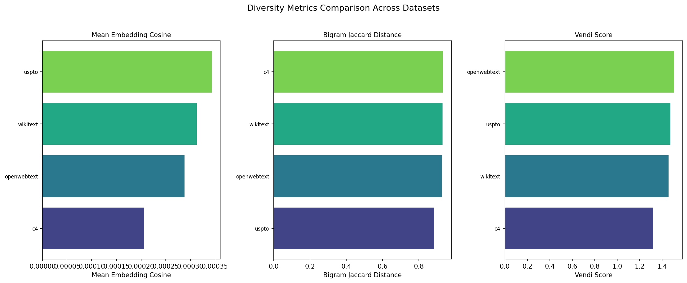
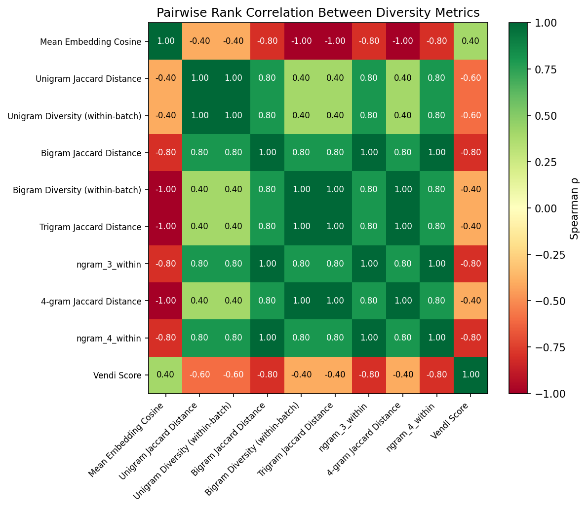

# Exp 02: Baseline Diversity Metrics — Results Summary

**TL;DR:** N-gram diversity metrics (1-4 gram, within-batch and cross-batch Jaccard) are highly correlated with each other (Spearman rho > 0.88) but not with Vendi score or mean embedding cosine similarity. This suggests different metrics capture different aspects of diversity. Task2Vec column is pending (network timeouts during computation).

**W&B Report:** https://wandb.ai/brando-su/beyond-scale-div-coeff/reports/Beyond-Scale:-Diversity-Coefficient-—-All-Experiments-—-2026-04-04--VmlldzoxNjQ0MDQ2NA==

---

## Config

| Parameter | Value |
|:---|:---|
| Datasets | C4, WikiText, The Pile, PubMed, USPTO, OpenWebText |
| Metrics computed | N-gram diversity (1-4 gram within/cross), mean embedding cosine, Vendi score |
| Tokenizer | GPT-2 |
| Samples per dataset | 1,000 |
| Batch size | 100 |
| Embedding model | all-MiniLM-L6-v2 (sentence-transformers) |

---

## Results

### Baseline Comparison

| Dataset | 1-gram Within | 2-gram Within | Vendi Score | Mean Embed Cosine | Task2Vec |
|:---|:---:|:---:|:---:|:---:|:---:|
| C4 | 0.200 | 0.713 | 1.366 | 0.000102 | — |
| WikiText | 0.215 | 0.689 | 1.443 | 0.000217 | — |
| The Pile | 0.191 | 0.664 | 1.603 | 0.000248 | — |
| PubMed | 0.146 | 0.620 | 1.429 | 0.000172 | — |
| USPTO | 0.116 | 0.525 | 1.490 | 0.000128 | — |
| OpenWebText | 0.191 | 0.688 | 1.440 | 0.000144 | — |

### Notable Rank Correlations (Spearman)

| Metric Pair | rho | p-value |
|:---|:---:|:---:|
| 1-gram within vs 2-gram cross Jaccard | 1.000 | 0.000 |
| 2-gram within vs 3-gram cross Jaccard | 1.000 | 0.000 |
| 3-gram within vs 4-gram within | 0.943 | 0.005 |
| 1-gram within vs Vendi score | -0.143 | 0.787 |
| 2-gram within vs Vendi score | -0.486 | 0.329 |
| Mean embedding cosine vs Vendi score | 0.600 | 0.208 |

---

## Plots

---

## Key Observations

1. N-gram metrics form a tight cluster of correlated measures — they all rank datasets similarly.
2. Vendi score and mean embedding cosine are uncorrelated with n-gram metrics, suggesting they measure structurally different diversity properties.
3. Task2Vec diversity coefficient computation failed due to HuggingFace dataset download timeouts — needs retry with local caching.
4. USPTO and PubMed consistently rank lowest on n-gram diversity, matching their known narrow-domain nature.
