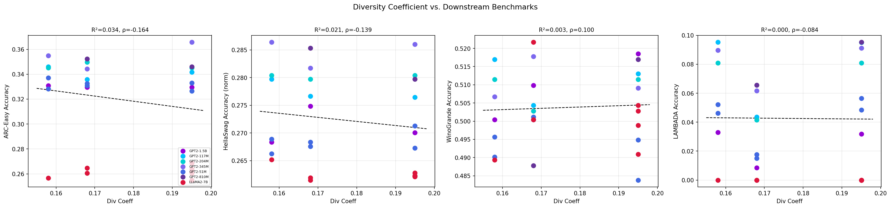
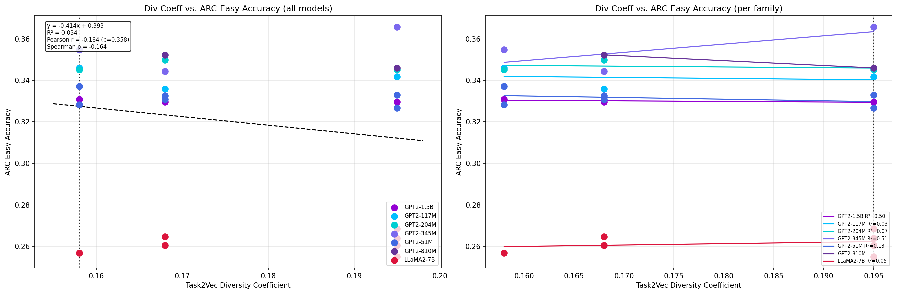
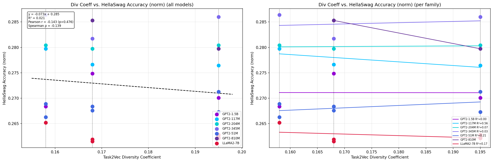
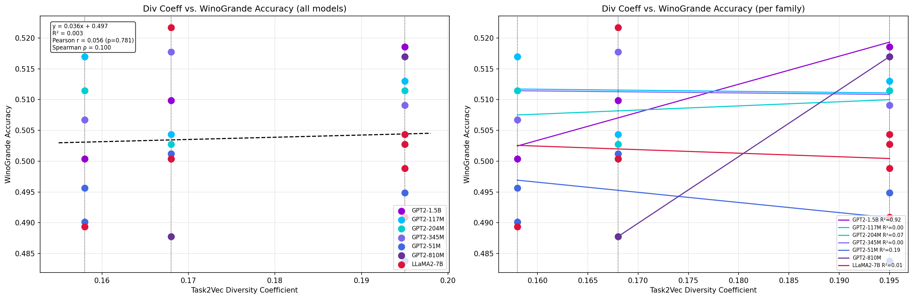
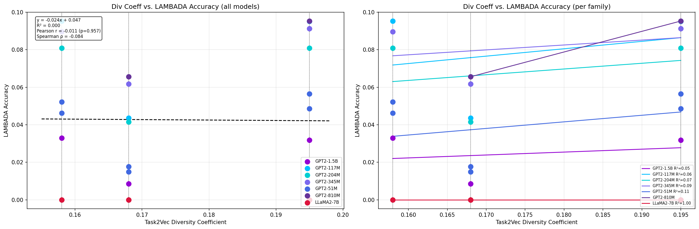

# Exp 03: Downstream Benchmarks — Results Summary

**TL;DR:** No statistically significant Spearman correlation between Task2Vec diversity coefficient and any accuracy-based downstream benchmark (ARC-Easy, HellaSwag, WinoGrande, LAMBADA) across 27 UDACA models (p > 0.4 for all). This challenges the paper's central claim that higher diversity reliably predicts better downstream performance.

**W&B Report:** https://wandb.ai/brando-su/beyond-scale-div-coeff/reports/Beyond-Scale:-Diversity-Coefficient-—-All-Experiments-—-2026-04-04--VmlldzoxNjQ0MDQ2NA==

---

## Config

| Parameter | Value |
|:---|:---|
| Models evaluated | 27 (20 GPT-2 + 7 LLaMA-2) |
| Model source | HuggingFace `UDACA/*` |
| Benchmarks | ARC-Easy, HellaSwag, WinoGrande, LAMBADA |
| Evaluation framework | lm-evaluation-harness (EleutherAI) |
| GPT-2 families | 51M (1.31B tokens), 51M (557M tokens), 117M, 204M, 345M, 810M, 1.5B |
| LLaMA-2 models | 7B (7 checkpoints: USPTO, PubMed, USPTO+PubMed) |
| Training data diversity | USPTO (div=0.158), PubMed (div=0.168), USPTO+PubMed (div=0.195) |
| Evaluation date | 2026-04-04 to 2026-04-06 |

---

## Results

### Spearman Correlations: Diversity Coefficient vs Benchmark Accuracy

| Benchmark | Spearman rho | p-value | Significant (p<0.05)? |
|:---|:---:|:---:|:---:|
| ARC-Easy | -0.164 | 0.413 | No |
| HellaSwag | -0.139 | 0.490 | No |
| WinoGrande | 0.100 | 0.618 | No |
| LAMBADA | -0.084 | 0.677 | No |

### Per-Model Results

| Model | Family | Div Coeff | ARC-Easy | HellaSwag | WinoGrande | LAMBADA |
|:---|:---|:---:|:---:|:---:|:---:|:---:|
| gpt2-51M-1.31B-USPTO | GPT2-51M | 0.158 | 0.337 | 0.266 | 0.496 | 0.046 |
| gpt2-51M-1.31B-PubMedAbs | GPT2-51M | 0.168 | 0.331 | 0.268 | 0.500 | 0.015 |
| gpt2-51M-1.31B-USPTOAndPubMedAbs | GPT2-51M | 0.195 | 0.333 | 0.267 | 0.495 | 0.049 |
| gpt2-117M-2.2B-USPTO | GPT2-117M | 0.158 | 0.346 | 0.280 | 0.517 | 0.095 |
| gpt2-117M-2.2B-PubMedAbs | GPT2-117M | 0.168 | 0.336 | 0.277 | 0.504 | 0.044 |
| gpt2-117M-2.2B-USPTOAndPubMedAbs | GPT2-117M | 0.195 | 0.342 | 0.276 | 0.513 | 0.095 |
| gpt2-345M-2.2B-USPTO | GPT2-345M | 0.158 | 0.355 | 0.286 | 0.507 | 0.090 |
| gpt2-345M-2.2B-PubMedAbs | GPT2-345M | 0.168 | 0.344 | 0.282 | 0.518 | 0.062 |
| gpt2-345M-2.2B-USPTOandPubMedAbs | GPT2-345M | 0.195 | 0.366 | 0.286 | 0.509 | 0.091 |
| gpt2-1.5B-180M-USPTO | GPT2-1.5B | 0.158 | 0.331 | 0.268 | 0.500 | 0.033 |
| gpt2-1.5B-180M-PubMedAbs | GPT2-1.5B | 0.168 | 0.330 | 0.275 | 0.510 | 0.009 |
| gpt2-1.5B-180M-USPTOAndPubMedAbs | GPT2-1.5B | 0.195 | 0.330 | 0.270 | 0.519 | 0.032 |
| llama2-uspto-ckpt-1 | LLaMA2-7B | 0.158 | 0.257 | 0.265 | 0.489 | 0.000 |
| llama2-pubmed-ckpt-2 | LLaMA2-7B | 0.168 | 0.265 | 0.262 | 0.500 | 0.000 |
| llama2-pubmed-ckpt-7 | LLaMA2-7B | 0.168 | 0.261 | 0.262 | 0.522 | 0.000 |
| llama2-uspto-pubmed-ckpt-3 | LLaMA2-7B | 0.195 | 0.255 | 0.262 | 0.504 | 0.000 |
| llama2-uspto-pubmed-ckpt-4 | LLaMA2-7B | 0.195 | 0.264 | 0.262 | 0.503 | 0.000 |
| llama2-uspto-pubmed-ckpt-5 | LLaMA2-7B | 0.195 | 0.261 | 0.263 | 0.499 | 0.000 |
| llama2-uspto-pubmed-ckpt-6 | LLaMA2-7B | 0.195 | 0.269 | 0.262 | 0.491 | 0.000 |

---

## Plots

---

## Key Observations

1. All Spearman correlations are weak (|rho| < 0.17) and non-significant (p > 0.4).
2. LLaMA-2 7B models all score 0.000 on LAMBADA regardless of training diversity.
3. Within the GPT2-345M family, the mixed dataset (div=0.195) achieves the best ARC-Easy score (0.366), but this pattern is inconsistent across families.
4. The diversity coefficient range (0.158-0.195) is narrow, which may limit the observable effect size.
